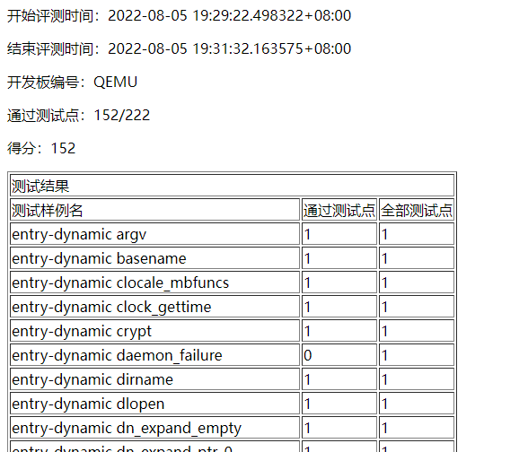

# musl-libc-test本地测试

使用说明：

运行：make PROJECT_PATH=<你的操作系统路径>

可以使用https://gitlab.eduxiji.net/20164448/expProject22340-3133.git作为示例操作系统进行测试。

稍等片刻会自动弹出浏览器显示评测结果。


你的系统需要在根目录下包含一个Makefile文件，该Makefile的all目标需要生成ELF格式的sbi-qemu和kernel-qemu两个文件，即与xv6-k210运行qemu时的方式一致。

如果你的系统不使用任何SBI，则不需要生成sbi-qemu文件，运行QEMU时会自动设置-bios参数为none。

运行QEMU的完整命令为：

```
qemu-system-riscv64 -machine virt -kernel kernel-qemu -m 128M -nographic -smp 2 -bios sbi-qemu -drive file=sdcard.img,if=none,format=raw,id=x0 -device virtio-blk-device,drive=x0,bus=virtio-mmio-bus.0 -initrd initrd.img

qemu-system-riscv64 --version
QEMU emulator version 4.2.1 (Debian 1:4.2-3ubuntu6.23)
Copyright (c) 2003-2019 Fabrice Bellard and the QEMU Project developers
```
